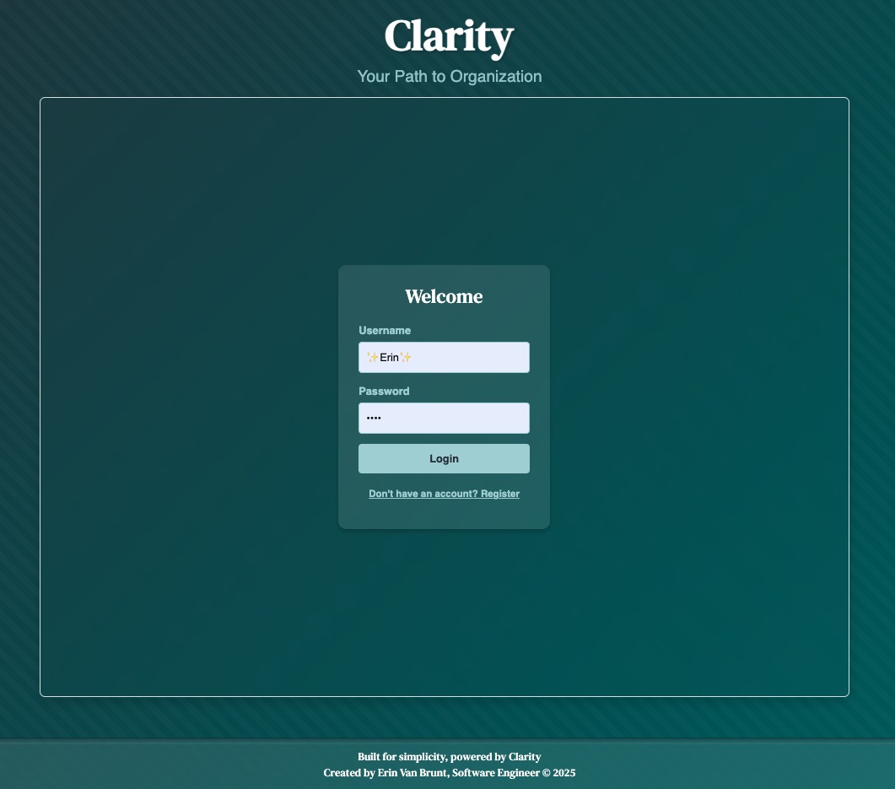
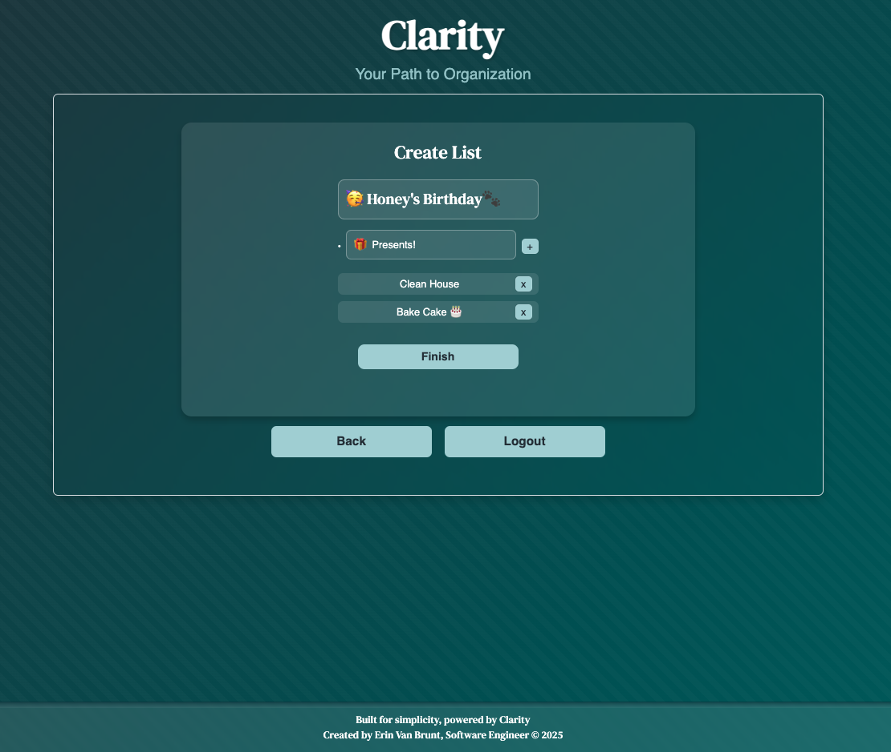
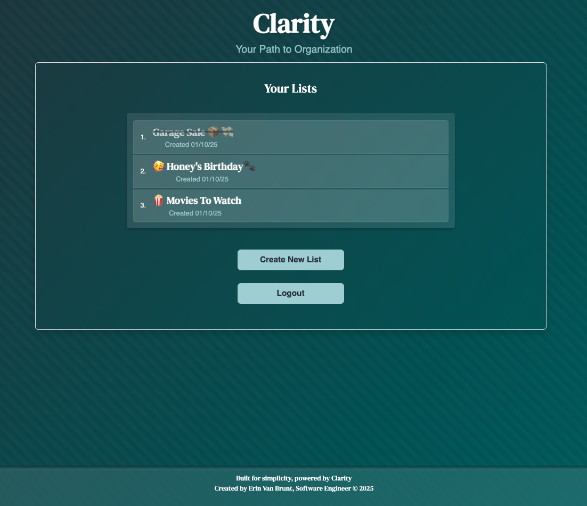

<h1 align="center">
✨ Clarity ✨
</h1>
<h3 align="center">
Your Path to Organization
</h3>


A modern full-stack to-do list application that helps users organize their tasks with secure authentication and real-time updates. Built with React and Node.js, Clarity offers an intuitive interface for managing personal task lists.

## Live Demo

Try Clarity now at: https://df-challenge-frontend.onrender.com

## Project Overview

<div align="center">



</div>
Clarity is a web-based task management system that allows users to:

- Create and manage multiple to-do lists
- Track task completion in real-time
- Secure personal tasks with user authentication
- Access their lists from any device

## Technology Stack 🛠️

### Frontend

- React.js
- React Router for navigation
- Bootstrap 5 for responsive design
- Context API for state management

### Backend

- Node.js with Express
- MongoDB with Mongoose
- JWT for authentication
- bcrypt for password hashing

### Testing

- Jest and Supertest for backend endpoint testing
- Comprehensive test suite for user authentication
- Automated testing for API responses and data validation

### Other Tools

- dotenv for environment variable management

## Application Structure

```plaintext
Frontend Routes:
/ - Home (wrapper component)
├── / - Entry (login/register forms)
└── /dashboard - Main application area
    ├── /dashboard - Lists overview
    ├── /dashboard/create-list - Create new list
    └── /dashboard/view-list - Single list view
```

## Features

### User Authentication

- Secure registration with email validation
- JWT-based authentication
- Password hashing with bcrypt
- Protected routes and API endpoints

### Task Management 📝

- Create multiple lists
- Real-time task status updates
- Mark individual tasks as complete
- Automatic list status tracking
- Delete completed lists

### Error Handling

- Form validation on both client and server side
- Meaningful error messages for users
- Email format validation
- Username uniqueness checking

### Testing & Validation

- Automated testing with Jest for critical endpoints
- User registration validation testing
- Duplicate user prevention verification
- Error handling test coverage
- API response validation

## API Endpoints 🎯

### Authentication

- POST /register - New user registration
- POST /login- User authentication

### Task Management

- GET /api/lists - Retrieve user's lists
- POST /api/lists - Create new list
- GET /api/lists/:listId - Get specific list
- PATCH /api/lists/:listId/items/:itemId - Update task status
- DELETE /api/lists/:listId - Remove list

## Getting Started

### Prerequisites

- Node.js (v14 or higher)
- MongoDB
- npm or yarn

### Environmental Variables

#### Create a .env file in the root directory:

```
MONGO_URI=your_mongodb_connection_string
JWT_SECRET=your_jwt_secret
PORT=4000
```

### Installation 🔧

1. Clone the repository

```
git clone https://github.com/YourUsername/clarity-todo.git
cd clarity-todo
```

2. Install dependencies

```
# Install backend dependencies
cd server
npm install

# Install frontend dependencies
cd ../client
npm install
```

3. Start the development servers

```
# Start backend (from server directory)
npm run start

# Start frontend (from client directory)
npm run start
```

# Deployment 🚀

## Current Deployment

- Frontend URL: https://df-challenge-frontend.onrender.com
- Backend URL: https://df-challenge.onrender.com
- Database: MongoDB Atlas

## Deployment Configuration

### MongoDB Atlas Setup

1. Database Configuration:
   - Created project "Clarity" in MongoDB Atlas
   - Established database "claritydb"
   - Configured network access (IP: 0.0.0.0/0)
   - Created database user with appropriate permissions

### Render Deployment

#### Backend Service (df-challenge)

1. Service Configuration:

   - Type: Web Service
   - Repository: Connected to GitHub
   - Root Directory: backend
   - Runtime: Node.js
   - Build Command: `npm install && npm uninstall bcrypt && npm install bcrypt --save`
   - Start Command: `node server.js`

2. Environment Variables:
   - `MONGO_URI`: MongoDB Atlas connection string
   - `JWT_SECRET`: Secret key for JWT authentication
   - `NODE_ENV`: production

#### Frontend Service (df-challenge-frontend)

1. Service Configuration:

   - Type: Static Site
   - Repository: Same GitHub repository
   - Root Directory: / (root level)
   - Build Command: `npm run build`
   - Publish Directory: build

2. Environment Variables:
   - `REACT_APP_API_URL`: https://df-challenge.onrender.com

### Frontend Configuration

1. API Connection Setup:
   - Created `config.js` for environment-based URL management
   - Configured production and development BASE_URLs
   - Updated all fetch calls to use BASE_URL
   - Removed proxy configuration from package.json

### Deployment URLs

Development Environment:

- Frontend: http://localhost:3000
- Backend: http://localhost:4000
- Database: Local MongoDB instance

Production Environment:

- Frontend: https://df-challenge-frontend.onrender.com
- Backend: https://df-challenge.onrender.com
- Database: MongoDB Atlas

### Deployment Process

1. Database Preparation:

   - Set up MongoDB Atlas cluster
   - Configure database access credentials
   - Enable network access
   - Obtain connection string

2. Backend Deployment:

   - Push code to GitHub
   - Create new Web Service in Render
   - Configure environment variables
   - Deploy and verify MongoDB connection

3. Frontend Deployment:

   - Create new Static Site in Render
   - Set environment variables
   - Deploy and verify backend connection

4. Verification Steps:
   - Test user registration flow
   - Verify login functionality
   - Test list creation and management
   - Confirm database operations

# Security Features

- JWT token expiration
- Password hashing
- Protected API endpoints
- Input sanitization
- Email validation
- Minimum password length requirements

# Contributing

- Fork the repository
- Create your feature branch (git checkout -b feature/AmazingFeature)
- Commit your changes (git commit -m 'Add some AmazingFeature')
- Push to the branch (git push origin feature/AmazingFeature)
- Open a Pull Request

# Acknowledgments

- MongoDB Atlas for database hosting
- Bootstrap for UI components
- React Router for navigation management
